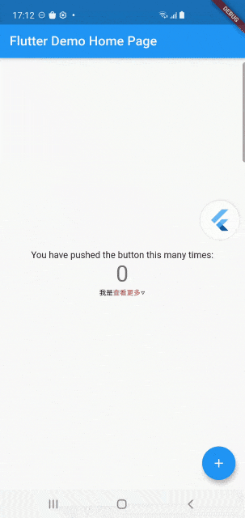
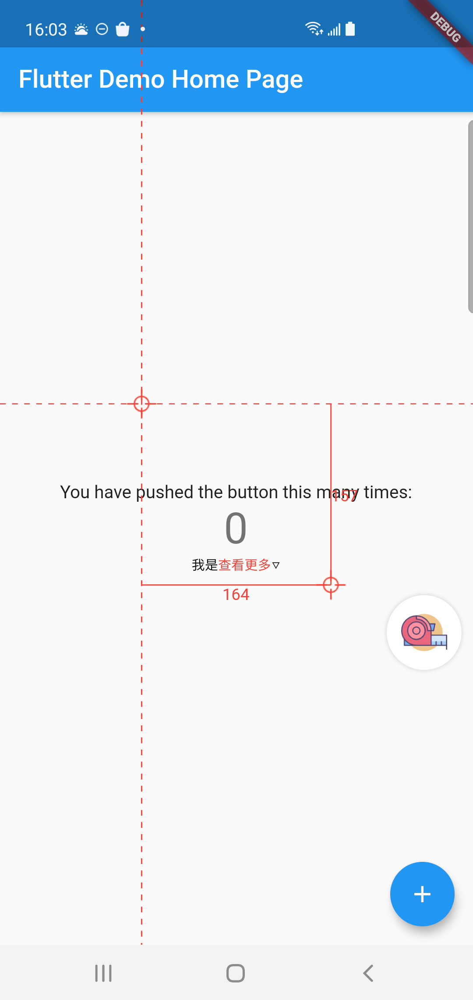
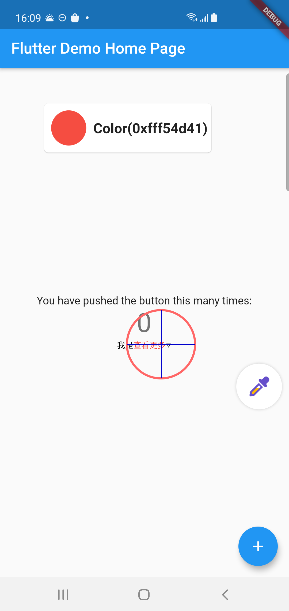
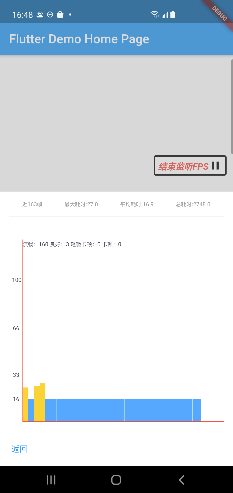

# flutter_fdb_package
Flutter应用的调试工具，面向完整开发过程的，协助采集性能优化、设计走查、QA测试等数据问题
目前已经提供了UI拾取、UI标尺、取色器、内存信息、FPS检测和页面代码等功能。

## 快速接入
1. 修改应用pubspec.yaml，添加工具依赖

   

2. 执行 **flutter pub update**或者**flutter pub get**

   

3. 导入调试工具的依赖

   ```dart
   import 'package:flutter_fdb_package/flutter_fdb_package.dart';
   ```

   

4. 使用FDB的Widget，包裹入口Widget

   方式一：包裹根App Widget

   ```dart
   void main() {
     return runApp(fdbEnterWidget(
         child: MyApp(
           key: Key(""),
         ),
         enable: true));
   }
   ```

   方式二：包裹App Widget下面的页面

   ```dart
       MaterialApp(
         title: 'Flutter Demo',
         theme: ThemeData(
           primarySwatch: Colors.blue,
         ),
         builder: (context, child) {
           return fdbEnterWidget(child: child);
         },
       );
   ```

## 功能介绍

### 入口组件


FlutterLogo图标可拖动，点击关闭当前功能并展开功能面板，再次点击收起功能面板。

### 功能组件

#### 控件拾取




拾取Widget组件信息，支持**文本编辑**

#### ui标尺



可自动拖动的UI标尺，用于辅助**对齐、尺寸**等需求

#### 取色器



可以拾取屏幕上任意点的像素，辅助取色


#### 帧率检测



查看一段时间内的帧率信息


#### 内存信息


查询总内存和已使用内存，分组查看类内存，以及对象详情


#### 页面代码


默认展示当前页面代码，可编辑查询任意仓库的代码


### 自定义组件

1. 继承FDBKit，实现抽象方法

   ```dart
   abstract class FDBKit {
     /// 工具在面板上的名字
     String get name;
   
     /// 工具点击的回调
     void onTrigger();
   
     /// 工具点击之后 在程序上显示的widget 比如是检测类型的、拖动类型的
     Widget buildWidget(BuildContext context);
   
     /// 工具在面板上展示的图片
     ImageProvider get iconImageProvider;
   
     /// 面板隐藏和展示的回调
     void contentWidgetVisibilityChange(bool visibility) {}
   }
   
   class CustomKit extends FDBKit{
     @override
     Widget buildWidget(BuildContext context) {
       return null;
     }
   
     @override
     ImageProvider get iconImageProvider => null;
   
     @override
     String get name => null;
   
     @override
     void onTrigger() {
     }
     
   }
   ```

   

2. 在入口执行之前**注册插件**

   ```dart
   FDBKitsManager.instance.register(CustomKit())
   ```

   

### 注意事项

目前仅支持Flutter1.12以上版本以上，并且，作为调试工具本应用只对非Release模式有效

### 参考以及引用

https://pub.flutter-io.cn/packages/shared_preferences
https://pub.flutter-io.cn/packages/vm_service
https://pub.flutter-io.cn/packages/fbroadcast
https://pub.flutter-io.cn/packages/path_drawing
https://pub.flutter-io.cn/packages/image
https://pub.flutter-io.cn/packages/syntax_highlighter
https://pub.flutter-io.cn/packages/flutter_ume
